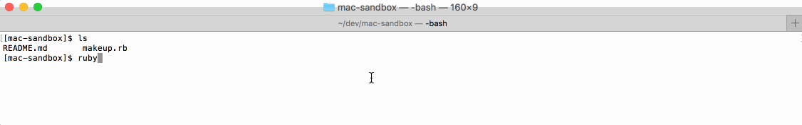
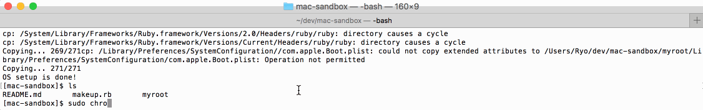

# Mac sandbox

## Purpose

The purpose is to make sandboxes in macOS, which allow us to install anything, destory anything and try new things freely like Docker containers.

## How to use

### Step 1. Make `myroot` directory by `makeup.rb`

```bash
cd <this repo>
ruby makeup.rb myroot
```



### Step 2. Enter the `myroot`

```bash
sudo chroot ./myroot
```



That's all !

## Available/unavailable commands

### Host environment

```
macOS Sierra
Version 10.12.6
```

### WORK!

#### Primitives

- [x] `cd`
- [x] `pwd`
- [x] `ls`
- [x] `bash`
- [x] `sh`
- [x] `bash`
- [x] `mkdir`
- [x] `rm`
- [x] `rmdir`
- [x] `touch`
- [x] `cat`
- [x] `grep`
- [x] `which`

#### Networking

- [x] `nslookup`
- [x] `dig`


#### Editors

- [x] `vi`
- [x] `vim`


#### Programming Languages

- [x] `perl`
- [x] `ruby`
- [x] `irb`

### NOT-WORK :(

#### Primitives

- [ ] `ps` - Killed: 9
- [ ] `sudo` - Killed: 9

#### Networking

- [ ] `curl` - cann't solve google.com
- [ ] `ping` - Killed: 9
- [ ] `telnet` - can't solve

#### Editors

- [ ] `nano` - Error opening terminal: xterm-256color.


#### Programming Languages

- [ ] `java` - ... FillMatcher: failed to create CFNumberFormatter There do not ...
- [ ] `javac` - ... FillMatcher: failed to create CFNumberFormatter There do not ...